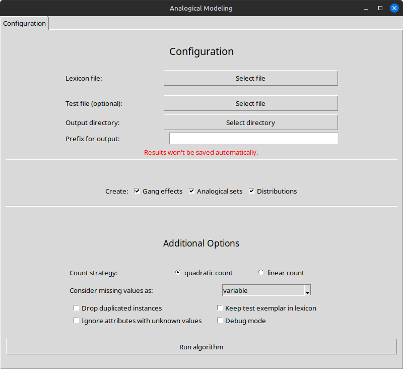
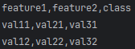
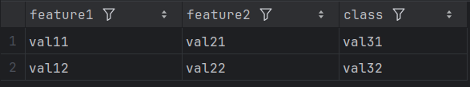
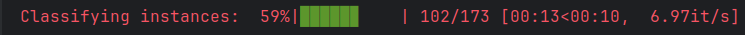
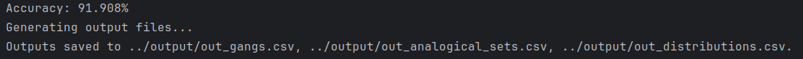
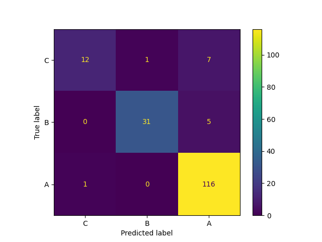

# Analogical Modeling Python - Step-by-Step Guide

You can choose between using the [graphical user interface (GUI)](#alternative-1-gui) and the
[terminal](#alternative-2-terminal) version.

# Alternative 1: GUI
You can either doubleclick on the `aml` application in your file explorer or
navigate to its location and type `./aml` in your terminal. In the latter case
you will receive some additional information on the running process.

<p align="center">
  
</p>

Once you have selected a lexicon file you can specify class and weights
column, set a threshold and select columns to ignore.
If you want to save your results, either specify an output prefix or an output
directory *and* the output prefix. Alternatively, you can save them by hand.  
The additional options are explained in
[2b) Setting additional Parameters](#b-setting-additional-parameters).

____

# Alternative 2: Terminal
## 0. Setup
It is advisable to use a **virtual environment** before installing the project.  
In your terminal, type:
```bash
python3.12 -m venv your_venv
source your_venv/bin/activate
```
Any Python installations made now will only affect the virtual environment.
It can be deactivated by writing `deactivate`.  
The following steps assume that you are working in an activated virtual environment.

## 1. Installation
```bash
pip install --editable .
pip install -r requirements.txt
```
This will install the project and all its dependencies.


## 2. Running
### a) Base Case
The minimally required arguments are:
1. Your **lexicon** file, which should be a CSV or Excel file with commas as
   separators. Please make sure that the class column is the last one.
<p align="center">
   →
  
</p>

2. The **path** where to store results, which can be either a prefix (`out`) or a path to a directory followed
   by a prefix (`path/to/directory/out`)

To run the algorithm type:
```bash
python3 aml.py -l <lexicon.csv> -o <output/path/with_prefix>
```
You will then see the default options and a progress bar printed to the terminal.  


When the algorithm finishes, it saves the **Gang effects** (`_gangs.csv`),
**Analogical sets** (`_analogical_sets.csv`) and **Distributions**
(`_distributions.csv`) to the specified location:


The generated confusion matrix ignores ties and needs to be saved by hand.
<p align="center">
  
</p>


### b) Setting additional Parameters
The following behaviour can be controlled through parameters:
1. [test file](#1-test-file)
2. [weights column](#2-weights-column)
3. [weights threshold](#3-weights-threshold)
4. [count strategy](#4-count-strategy)
5. [ignoring columns](#5-ignoring-columns)
6. [handling missing data](#6-handling-missing-data)
7. [keeping text exemplars](#7-keeping-test-exemplars)
8. [handling duplicated instances](#8-handling-duplicated-instances)
9. [handling attributes with missing values](#9-handling-attributes-with-missing-values)
10. [debug mode](#10-debug-mode)

#### 1. Test File
The test file needs to be in the same format as the lexicon, with the same
attributes in the same order. The class column and any ignored columns
(see [5. ignoring columns](#5-ignoring-columns)) may or may not be present.
You will receive neither an accuracy score nor a confusion matrix if you
use a test file.

**Usage**: Add `--test <path/to/test>` or shorter `-t <path/to/test>` to the
command.

If you don't provide a test file, the algorithm will perform leave-one-out
classification on all instances of the lexicon.


#### 2. Weights Column
If you use weighted instances, you can specify a weights column which will
then *not* be considered an attribute for classification. The weights need
to be numerical.

**Usage**: Add `--weights_column <column_name>` or shorter `-w <column_name` to
the command.

Instances with weight 0 will still affect the algorithm, as they impact the
heterogeneity of a supracontext. Set a threshold if you want them to be
ignored.

#### 3. Weights Threshold
If you want to ignore instances with small weights, you can include a
threshold together with the weights column. This threshold can be any
non-negative real number.

**Usage**: Add `--threshold <value>` or shorter `-th <value>` to the
command.

#### 4. Count Strategy
The Analogical Modeling algorithm uses the **quadratic** count strategy for
pointer values per default. You can change this to **linear**.

**Usage**: Add `--linear` or simply `-L` to the command.

#### 5. Ignoring Columns
If your data contains columns with additional information, e.g. for
documentation or comments, or you want to investigate the impact of specific
attributes without changing the lexicon every time, you can specify columns
to be ignored.

**Usage**: Add `--ignore_columns <column1 column2 ...>` to the command.

Weights and class columns must not be ignored.

#### 6. Handling Missing Data
If your data contains missing values (specified by `=`), you can define how
to treat them.

**Usage**: Add `--missing_data <option>` or shorter `-m <option>` to the
command.

The options are:
- `variable` (default): treat missing values as variables, thus only matching
  other missing values
- `match`: treat missing values as wildcards that match anything
- `mismatch`: missing values do not match anything

#### 7. Keeping Test Exemplars
Per default, the algorithm ignores instances with the same attribute
values as the instance to be classified (the class does not need to be the
same).

If you disable this and do not use a test file, your accuracy will always
be at 100% as the instance to be classified will be compared to itself as
well.

**Usage**: Add `--keep_test` or simply `-k` to the command.

#### 8. Handling Duplicated Instances
You can remove all duplicated instances (instances with the same attribute
values and the same class) from the lexicon.

**Usage**: Add `--drop_duplicates` or simply `-d` to the command.

#### 9. Handling Attributes with Missing Values
Attributes that include unknown values (`=`) can be ignored for all instances.

**Usage**: Add `--ignore_unknowns` or shorter `-i` to the command.

#### 10. Debug Mode
The debug mode logs additional information (classified instances, weights
threshold) and any Exceptions that might occur.

**Usage**: Add `--debug` or `-D` to the command.
